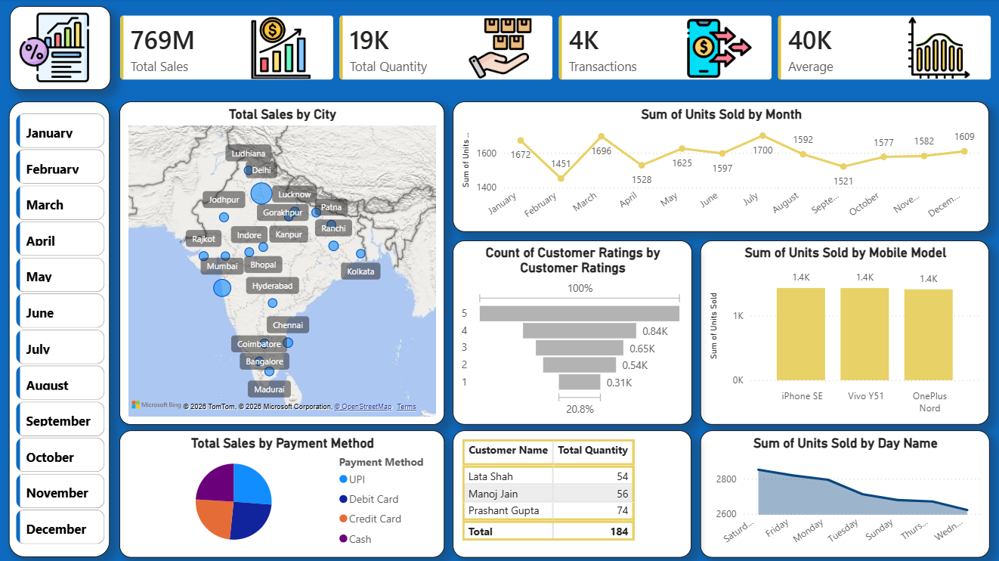

# Mobile Sales Dashboard | Power BI 📊

## Project Overview

Designed and developed an interactive Mobile Sales Dashboard using Power BI to analyze sales performance and business trends from mobile sales data. The dashboard transforms raw Excel data into actionable insights through dynamic visualizations, KPI tracking, and user-friendly reporting.

The project focuses on sales analysis, customer purchasing behavior, regional performance, and product-level insights to support data-driven business decisions.

---

## Tools & Technologies

* Power BI
* Microsoft Excel
* Data Cleaning & Transformation
* Data Visualization
* Business Intelligence Reporting

---

## Dashboard Features

* Interactive KPI Dashboard
* Monthly and Yearly Sales Trend Analysis
* Revenue and Profit Tracking
* Top Performing Mobile Brands & Models
* Region-wise Sales Performance
* Customer Purchase Analysis
* Dynamic Filters and Slicers for Drill-down Analysis

---

## Key Business Insights

* Identified top-performing products and high-revenue regions
* Analyzed monthly sales fluctuations and seasonal trends
* Compared sales performance across multiple product categories
* Improved business understanding through interactive visual storytelling

---

## Dashboard Preview

### Main Dashboard

---

## Learning Outcomes

* Developed hands-on experience in Power BI dashboard development
* Improved data visualization and business storytelling skills
* Learned best practices for interactive reporting and KPI analysis
* Strengthened understanding of sales analytics using real-world datasets

---

## Future Improvements

* Integration with SQL databases
* Real-time dashboard connectivity
* Predictive sales analysis
* Advanced DAX calculations and forecasting

---

## Author

Muskan Solanki
Aspiring Data Analyst | Power BI | Python | SQL | Excel
